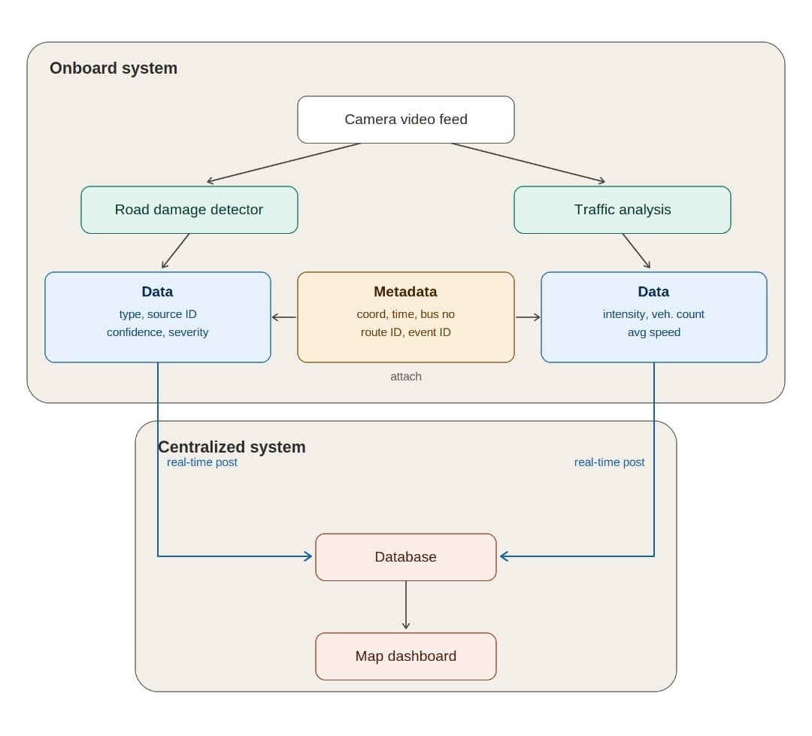
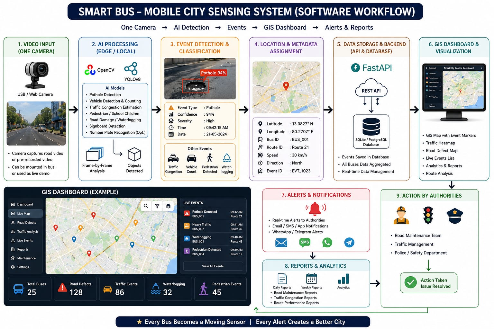

# Road Survey — Project Base

Road survey system that reuses existing cameras already installed in public
transport vehicles (buses) to sense road and traffic conditions across a city.

Built for Smart India Hackathon problem statement **26124**.

## Problem statement

**Title:** AI-Powered Mobile Urban Intelligence Platform Using Public Transport Fleet

**Background**

Urban public transport buses traverse almost every major road in a city every
day. Modern buses are increasingly equipped with multiple cameras covering the
front, rear, sides, and passenger cabin. However, these cameras are primarily
used for recording incidents and are not leveraged as intelligent sensing
platforms. At the same time, city authorities rely on fixed CCTV cameras,
manual inspections and citizen complaints to identify road defects, traffic
congestion, missing infrastructure and unsafe driving behaviour. This results
in delayed response, incomplete situational awareness and inefficient
maintenance planning.

**Description**

Develop an AI-powered onboard and centralized software platform that
transforms public transport buses into mobile urban sensing units. The
onboard software shall analyse video streams from multiple bus-mounted
cameras to detect road defects such as potholes, damaged roads, missing road
dividers, missing zebra crossings, damaged or missing traffic signboards,
waterlogging and other road hazards. It shall estimate vehicle density
through vehicle detection, classification and counting, identify traffic
bottlenecks, and detect vulnerable pedestrian situations such as school
children crossing roads. During incidents such as hit-and-run or rash
driving, the system should detect and track the offending vehicle, extract
the registration number with a confidence score, timestamp and GPS location,
and securely share alerts with a central command system. The centralized
platform shall aggregate information from the entire bus fleet, visualize
events on a GIS map, generate congestion heat maps, identify infrastructure
deficiencies, analyse origin–destination traffic patterns, estimate route
delays and provide actionable insights for transport authorities.

**Expected Solution**

The solution should provide an edge-AI onboard processing framework
integrated with a centralized urban intelligence platform. It should
generate reliable alerts, GIS-based dashboards, road condition maps, traffic
analytics and incident reports to support proactive road maintenance,
improved traffic management, enhanced public safety and evidence-based
decision making while minimizing bandwidth through intelligent edge
processing.

## Architecture

The full onboard/centralized split — camera feed in, road damage and traffic
analysis running locally, metadata attached, and both streams posted in
real time to a central database feeding a map dashboard:

The complete intended software workflow, end to end from camera input through
AI processing, event detection, location tagging, storage, GIS dashboard,
alerts, reports and action by authorities:

## Scope of this prototype

This is a prototype, not the full platform — most of the components shown
above are not implemented. The pieces actually being built for V1:

- Pothole and road damage detection (AI processing)
- Event detection and classification
- Location and metadata assignment (simulated)
- Data storage to a local PostgreSQL database via FastAPI
- Dashboard and visualization

Traffic analysis appears in the architecture diagram but is **omitted for
V1**.

## Model

Detection uses **YOLOv12s**, pretrained, chosen after comparing it against
other YOLO architectures and checkpoints — see
[`road-damage-lab/`](../road-damage-lab/) for the comparison bench and
[`road-damage-lab/docs/model-comparison-2026-08-26.md`](../road-damage-lab/docs/model-comparison-2026-08-26.md)
for the writeup.

## Data

Road footage sourced from:
[RADRoad Anomaly Detection dataset](https://www.kaggle.com/datasets/rohitsuresh15/radroad-anomaly-detection/data)
(Kaggle).
