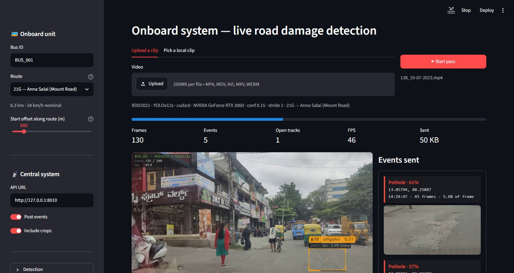
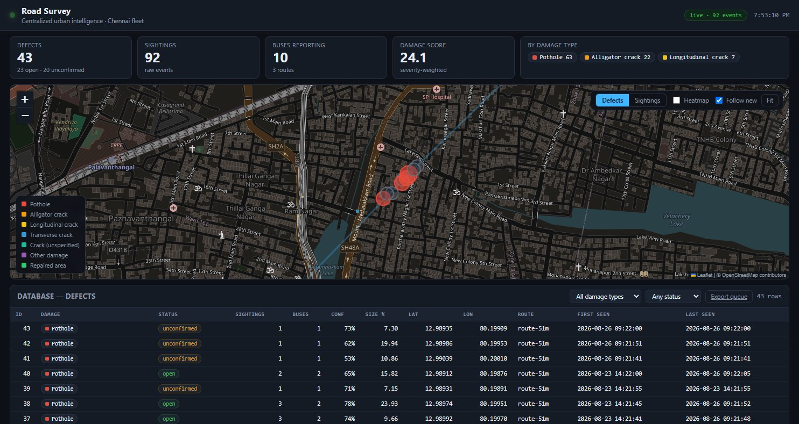
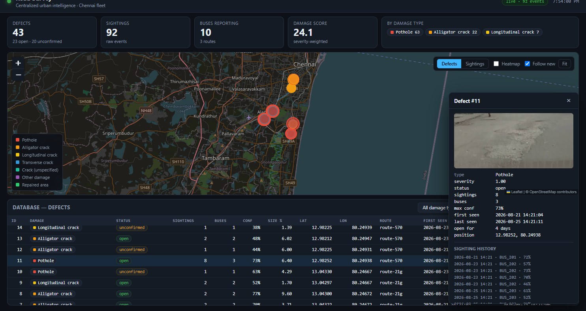

# Road Survey

Turns public transport buses into mobile road-condition sensors. Cameras
already fitted to city buses watch the road; an onboard unit detects road
damage, tags it with position and time, and posts one small event per defect to
a central system that clusters repeat sightings, maps them, and ranks a
maintenance queue.

Prototype for SIH problem statement **26124** — see [Docs/Base.md](Docs/Base.md)
for the statement and [Docs/V1-Plan.md](Docs/V1-Plan.md) for the build plan.

---

## The two windows

### Window 1 — onboard system

`edge/`, Streamlit on `:8501`. Upload a clip, watch annotated frames stream with
boxes and track IDs, watch events fire as each defect leaves frame.



Every defect leaves the bus as one event plus one ~9 KB crop. The **Sent**
counter is the edge-processing argument, measured live: 50 KB against a 12.3 MB
clip in the shot above. **Video never leaves the bus.**

### Window 2 — centralized system

`server/`, FastAPI on `:8010`. Leaflet map of the fleet's defects, with the
database as a live table directly below it. Both update in real time as window
1 processes.



The map plots **defects**, not sightings. 92 sightings from 10 buses collapse
into 43 physical defects — `open` where more than one bus agrees, `unconfirmed`
where only one has seen it.

### Why that distinction matters



Click a defect and you get its evidence: the best crop, and every bus that has
reported it. This one was seen **8 times by 3 different buses over 4 days** —
a far stronger claim than any single confidence score, and the thing that turns
a pile of detections into a maintenance work order.

---

## Quick start

Torch first, matching your CUDA version, then everything else:

```bash
pip install torch torchvision --index-url https://download.pytorch.org/whl/cu128
pip install -r road-damage-lab/requirements.txt
pip install -r edge/requirements.txt
pip install -r server/requirements.txt
```

**Window 2** — the control room:

```bash
cd server
python run.py            # starts with an empty map
python run.py --keep     # ...or keep what was already reported
# dashboard at http://127.0.0.1:8010
```

**`run.py` starts empty by default.** Test passes otherwise pile up into a map
nobody can read, so each start clears reported data — sightings, the defects
clustered from them, the bus roster and stored crops. Routes survive; they're
configuration, re-seeded from `edge/routes/` every startup.

To clear without restarting (the dashboard notices and empties itself):

```bash
curl -X POST http://127.0.0.1:8010/api/admin/reset
```

**Window 1** — the bus:

```bash
cd edge
streamlit run app_edge.py
# onboard UI at http://127.0.0.1:8501
```

Pick a clip, press **Start pass**, and watch pins land in window 2.

Optional, and worth doing before showing anyone — give the map a fleet history
so the live pass lands on defects that already exist:

```bash
cd edge
python seed_demo.py            # 15 passes, ~2 min
```

Seeded history is reported data, so it is cleared by the next plain `run.py`.
On demo day either seed *after* starting the server, or restart with `--keep`.

> **Why 8010 and not 8000?** 8000 is a crowded port. If something else is
> already listening there, the onboard unit posts events into whatever that
> happens to be, and the failure looks like a network problem rather than a
> misconfiguration. Both halves default to 8010 so it just works. To use a
> different port: `python run.py --port N`, then set the same URL in window 1's
> **API URL** box (or export `ROADSURVEY_API_URL`).

> Uses SQLite by default so it runs with nothing installed. For Postgres:
> `DATABASE_URL=postgresql+psycopg://user:pw@localhost/roadsurvey`

---

## Components

### [`road-damage-lab/`](road-damage-lab/) — the bench

Where the model was chosen. 27 registered YOLO checkpoints over one canonical
damage taxonomy, side-by-side comparison, and a road-condition report. V1 runs
`rdd-yolo12s` at conf 0.15; the evidence is in
[the comparison writeup](road-damage-lab/docs/model-comparison-2026-08-26.md).

Unchanged by the rest of the project — `edge/` and `server/` import `labcore`
rather than duplicating the detector or the taxonomy, so a pothole is the same
red in the video overlay and on the map.

### [`edge/`](edge/) — onboard

`labcore` gives per-frame detections. The edge adds the three things an onboard
unit needs and a benchmark doesn't:

- **Event lifecycle** ([`events.py`](edge/edgecore/events.py)) — watches each
  track and emits **one event when it closes**, rather than a row per frame.
  Position, time and crop are sampled at the track's *peak-area* frame: the
  largest the box ever gets is the closest the bus ever came to the defect.
- **Simulated GPS** ([`gps.py`](edge/edgecore/gps.py)) — walks a traced Chennai
  bus corridor at a nominal speed. Real GPX/CSV replays behind the same
  interface.
- **Publisher** ([`publisher.py`](edge/edgecore/publisher.py)) — posts from a
  worker thread so inference never waits on the network, and **spools to disk
  when the network is gone**, draining on the next pass that connects.

`app_edge.py` (UI) and `run_edge.py` (CLI) are both thin front-ends over
`pipeline.py`.

### [`server/`](server/) — centralized

Two tables doing two jobs. **`events`** is the raw log — one row per sighting,
never merged, never deleted. **`defects`** is the physical thing in the road,
and it's what the map plots.

On ingest a sighting joins the nearest same-type defect within ~15 m, or starts
a new one. That's what makes three claims possible that a per-event map cannot
make:

| | |
|---|---|
| **Confirmation** | "seen by 4 buses on 11 passes" beats "the model said 0.61" — a one-off stays `unconfirmed` and greys out |
| **Age** | `first_seen` → today gives "7 days open", which is what ranks a queue |
| **Closure** | a defect that stops being reported *on a route still being driven* is a repair that verified itself |

Ingest is idempotent on `event_uid`, so a publisher retry can't double-count.

---

## What's real and what's simulated

Stated plainly rather than left for a reviewer to find.

**Real** — the footage, the detections, the tracking, the event lifecycle, the
clustering and confirmation logic, the bandwidth reduction, the offline spool.

**Simulated** — GPS position, timestamps, that there is more than one bus, the
multi-day history, and repair events.

The dataset has no repeat traversals, so repeat passes are the same clip
replayed as another bus with `--stride 3 --phase N`, which samples *different
frames* and therefore genuinely detects differently. Measured: phases 0/1/2 over
`62_10-07-2023.mp4` give 5/4/5 events, and phase 1 misses a pothole the other
two catch — so confirmation counts carry real information rather than being
decoration. Details in [Docs/V1-Plan.md](Docs/V1-Plan.md).

**Auto-close is not demonstrable from this footage** — nothing in the clips ever
gets repaired. The rule ships with unit tests instead
([`server/tests/`](server/tests/test_clustering.py), 16 tests).

---

## Out of scope for V1

Traffic analysis (the right branch of the architecture), number-plate
recognition, waterlogging, signboards and pedestrian detection. The onboard
agent has exactly one detector branch.
