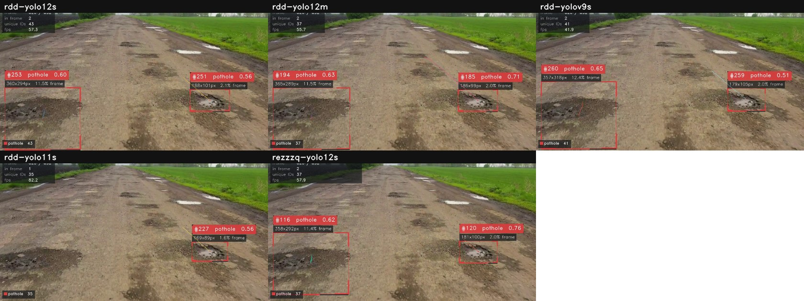
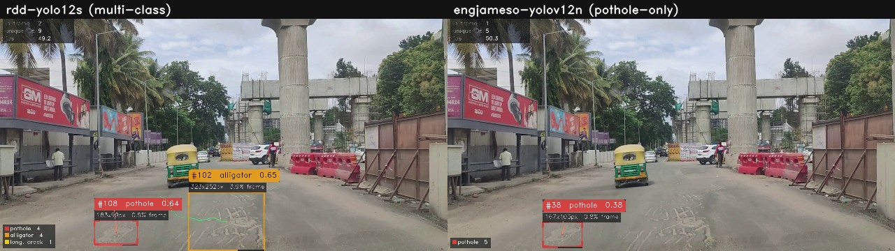
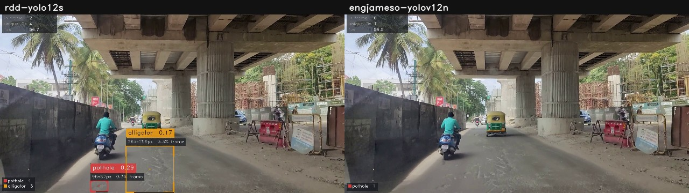

# Model comparison — 2026-08-26

Manual comparison run through the Streamlit app across three clips: the stock
`mixkit-potholes-in-a-rural-road-25208-hd-ready.mp4` test clip, and two real
survey clips (`138_10-07-2023.mp4`, `62_10-07-2023.mp4`). Conclusion from that
session: **`rdd-yolo12s` was the most accurate model tried; other models missed
some damage, and occasionally flagged non-damage as damage.**

This doc reproduces that comparison from the CLI (`run_cli.py --benchmark`,
same clips, each model at its own `models.yaml` default settings — see
[Reproducing this](#reproducing-this)) to put numbers behind it, and pulls
matched frames from the actual saved run outputs as visual evidence. The
independent run **supports the headline conclusion with one nuance**: coverage
(catching crack types a pothole-only model structurally cannot see) drives most
of the advantage, not raw pothole recall alone — see [Nuance](#nuance-pothole-only-recall).

## Results — five RDD2022 architectures, `mixkit-potholes` clip (692 frames, full clip)

| model | boxes | mean conf | ms/frame | unique potholes | unique alligator |
|---|---:|---:|---:|---:|---:|
| **rdd-yolo12s** | 1061 | 0.42 | 16.7 | **47** | 0 |
| rdd-yolo12m | 1156 | 0.47 | 17.4 | 42 | 0 |
| rdd-yolov9s | 920 | 0.37 | 24.7 | 44 | 0 |
| rdd-yolo11s | 893 | 0.46 | 11.7 | 38 | 0 |
| rezzzq-yolo12s | 665 | 0.55 | 16.2 | 39 | 1 |

`rdd-yolo12s` found the most distinct potholes of the five (47, vs. 38–44 for
the rest) — the clearest single number behind "most accurate." `rezzzq-yolo12s`
(a separately-trained YOLOv12s) is notably more conservative — fewer boxes,
higher mean confidence — and was the only model in this group to catch an
alligator crack on this clip.

**Visual confirmation — a miss.** Same frame (620/692), all five models:



`rdd-yolo11s` (bottom-left) caught only the small distant pothole and missed
the large one in the foreground that all four other models caught. That's a
concrete instance of the "misses damage" observation, not a knock against
`rdd-yolo11s` specifically — it's also the fastest of the five (85 fps vs.
55–65 for the others), so the miss tracks with the accuracy/speed trade-off
its architecture is making.

## Results — real survey footage, `62_10-07-2023.mp4` (306 frames, full clip)

`rdd-yolo12s` (4-class) vs. `engjameso-yolov12n` (pothole-only specialist):

| model | boxes | mean conf | unique potholes | unique alligator | unique long. crack |
|---|---:|---:|---:|---:|---:|
| rdd-yolo12s | 412 | 0.38 | 5 | 7 | 2 |
| engjameso-yolov12n | 119 | 0.38 | 8 | — (can't detect) | — (can't detect) |

This is the nuance: on raw pothole count alone, the specialist edges ahead (8
vs. 5) on this clip. `rdd-yolo12s` wins overall because it also caught 7
alligator cracks and 2 longitudinal cracks — real road damage the specialist
is architecturally blind to, not something it "missed" so much as something it
was never trained to see.

**Visual confirmation — coverage advantage.** Frame 195/306, same source:



Both models catch the same pothole; `rdd-yolo12s` at higher confidence (0.64
vs. 0.38) and with an adjacent alligator crack (0.65) flagged alongside it that
the specialist has no class for.

**Visual honesty — even the best model has a weak spot.** Frame 45/306:



Under the flyover shadow, `rdd-yolo12s` fires a `pothole 0.29` and an
`alligator 0.17` on what looks like plain shadowed pavement, not visible
damage — plausibly the "hallucinates other objects as damage" behavior from
the original session, though both are near the model's own 0.15 confidence
floor. `engjameso-yolov12n` stays silent on the same patch. Worth noting for
anyone using `rdd-yolo12s` output directly: **treat anything under ~0.3
confidence as needing a human look**, especially in shadow.

## Recommendation

`rdd-yolo12s` is already the top-listed, default-selected entry in
`models.yaml` — this experiment validates that choice rather than changing it.
Two things worth carrying forward:

1. When only potholes matter and speed/cost is tight, a pothole specialist
   (`engjameso-yolov12n`) is a reasonable trade — it wasn't clearly worse on
   pothole recall alone in this test, just blind to crack types.
2. Don't take `rdd-yolo12s` boxes below ~0.3 confidence at face value without
   a look — that's where the one plausible false positive in this test showed
   up.

## Reproducing this

```bash
cd road-damage-lab
python run_cli.py -m rdd-yolo12s -m rdd-yolo12m -m rdd-yolov9s -m rdd-yolo11s -m rezzzq-yolo12s \
  -s data/videos/mixkit-potholes-in-a-rural-road-25208-hd-ready.mp4 --no-save

python run_cli.py -m rdd-yolo12s -m engjameso-yolov12n \
  -s data/videos/62_10-07-2023.mp4 --no-save
```

Each model runs at its own `default_conf` from `models.yaml` (0.15 for the RDD
models, 0.25 for `engjameso-yolov12n`) with tracking on (ByteTrack), full clip,
no frame stride. `--no-save` skips re-writing the annotated `.mp4`s; drop it to
regenerate them.
